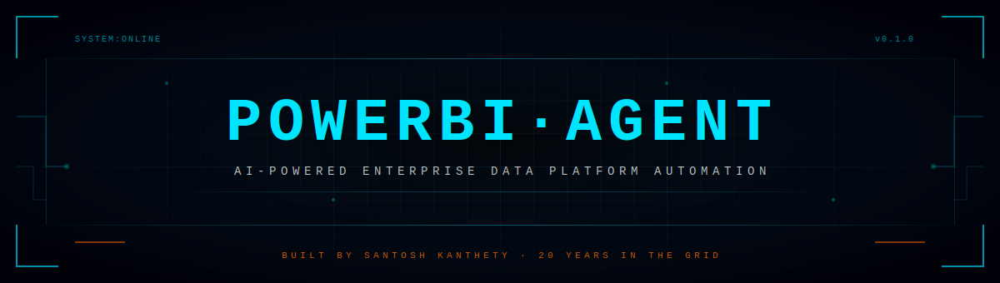
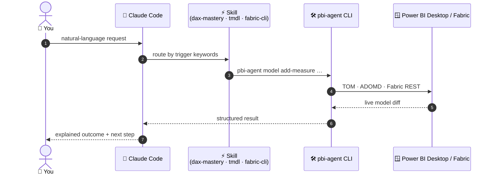
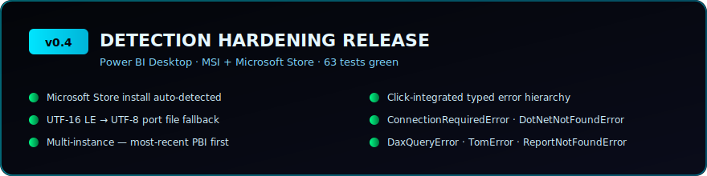
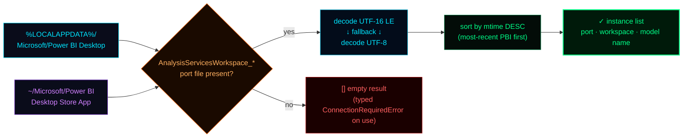
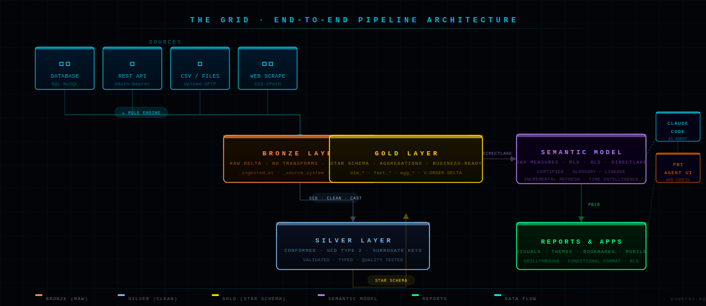
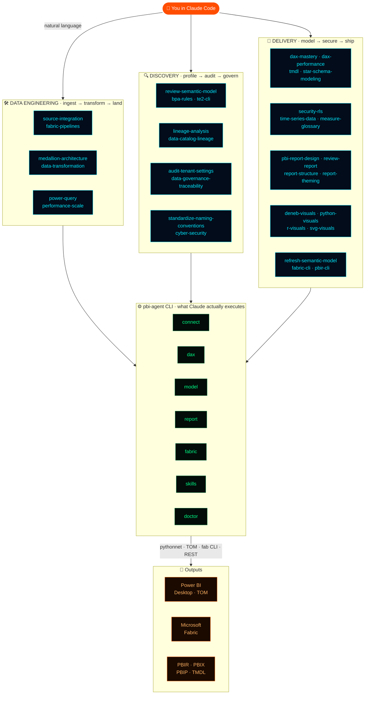
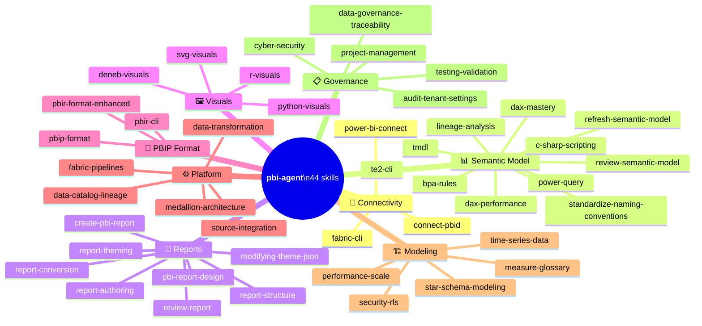

<div align="center">



<br/>

[](https://pypi.org/project/powerbi-agent/)
[](https://pypi.org/project/powerbi-agent/)
[](LICENSE)
[](https://github.com/santoshkanthety/powerbi-agent/stargazers)
[](https://github.com/santoshkanthety/powerbi-agent/actions)
[](https://www.linkedin.com/in/santoshkanthety/)

</div>

---

> **The agent layer for Power BI analytics delivery.** A Click CLI plus 44 Claude Code skills that streamline **Data Engineering · Discovery · Delivery** — natural-language prompts become TOM, ADOMD, TMDL, PBIR, and Fabric REST calls. Board-ready analytics, without the ceremony. **No web UIs. No config sprawl. Just the CLI, the skills, and your model.**

```
╔══════════════════════════════════════════════════════════════════╗
║  MISSION BRIEFING                                                ║
║                                                                  ║
║  Three jobs stand between raw data and a board-ready report:     ║
║                                                                  ║
║    [DE] DATA ENGINEERING                                         ║
║         Sources · Bronze/Silver/Gold · Delta · Fabric pipelines  ║
║                                                                  ║
║    [DX] DISCOVERY                                                ║
║         Profiling · BPA · lineage · governance · model audit     ║
║                                                                  ║
║    [DL] DELIVERY                                                 ║
║         Star schemas · DAX · RLS · PBIR layouts · refresh        ║
║                                                                  ║
║  Each job is hours of TMDL, DAX, fab CLI, TOM scripting,         ║
║  Deneb specs, BPA rules and PBIR JSON.  You know all of this.    ║
║  POWERBI·AGENT gives the time back.                              ║
╚══════════════════════════════════════════════════════════════════╝
```

### `> 30-SECOND TOUR`

```powershell
pip install "powerbi-agent[desktop,fabric]"      # 1. install
pbi-agent skills install                         # 2. wire 44 skills into Claude Code
pbi-agent connect                                # 3. attach to open Power BI Desktop
```

Then in Claude Code:

> *"Add a rolling 12-month revenue measure with a June fiscal year-end, run BPA, and refresh the Sales Analytics dataset in Fabric."*

Claude picks the right skill, calls `pbi-agent` (TOM / ADOMD / Fabric REST), and reports back with a real diff — not a code suggestion you have to paste.



### `> WHAT'S NEW`



| Release | Highlights |
|---|---|
| **v0.4 — hardening** | Microsoft Store install of Power BI Desktop now auto-detected · UTF-16 / UTF-8 port file fallback for older PBI builds · multi-instance detection sorts by most-recently-opened · Click-integrated typed errors (`PowerBIAgentError`, `ConnectionRequiredError`, `DotNetNotFoundError`, `DaxQueryError` …) · 63 tests, all green |


*v0.4 detection hardening — both PBI Desktop install variants resolve through the same fallback chain.*
| **v0.3** | 44-skill library — TMDL, BPA, Deneb, Python/R visuals, fab CLI, TOM/ADOMD, PBIR/PBIP, Power Query, naming conventions, lineage |
| **v0.2** | Windows installation hardening — PATH, UTF-8 console, pythonnet, bundled skill assets |
| **v0.1** | Core CLI — `connect`, `dax`, `model`, `report`, `fabric`, `doctor` |

### `> WHY POWERBI·AGENT`

| | **Skill packs alone** | **Raw `pbi-cli`** | **`powerbi-agent`** |
|---|---|---|---|
| Natural-language workflows in Claude Code | ✓ | — | ✓ |
| Direct TOM / ADOMD interop with PBI Desktop | — | ✓ | ✓ |
| Fabric REST (workspaces · datasets · refresh) | — | — | ✓ |
| Spans **Data Engineering · Discovery · Delivery** | — | — | ✓ |
| One-command install of CLI + 44 skills | — | — | ✓ |
| Multi-install detection (MSI + Microsoft Store) | — | partial | ✓ |
| MIT-licensed, PyPI-distributed | n/a | ✓ | ✓ |

---

## `> SYSTEM_OVERVIEW`





---

## `> PREREQUISITES`

Before installing, ensure the following are in place:

| Requirement | Version | Notes |
|---|---|---|
| **Python** | 3.10 – 3.13 | `python --version` (3.14+ works for Fabric-only; Desktop requires ≤3.13) |
| **pip** | Latest | `python -m pip install --upgrade pip` |
| **Claude Code** | Latest | [Install guide](https://claude.ai/code) — required for skills |
| **Power BI Desktop** | Latest | Windows only · Required for `pbi-agent connect`, DAX, TOM/ADOMD commands |
| **Power BI Report Builder** | Latest | Windows only · Provides TOM & ADOMD DLLs for model/DAX commands. [Download](https://www.microsoft.com/en-us/download/details.aspx?id=58158). Override path with `PBI_REPORT_BUILDER` env var |
| **Windows OS** | 10 / 11 | Desktop integration uses .NET/pythonnet — Linux/macOS work for Fabric-only workflows |
| **Microsoft Fabric / Power BI Service** | — | Required for `pbi-agent fabric` commands — Azure subscription needed |
| **fab CLI** | Latest | `pip install ms-fabric-cli` — required for `fabric-cli` skill |
| **pbir.tools** | 0.9.4+ | `uv tool install pbir-cli` — required for `report-structure`, `report-theming`, `report-conversion` skills |
| **Azure AD / Entra ID account** | — | Required for Fabric authentication (`pbi-agent fabric login`) |

> **Minimal setup** (Fabric + Claude Code only, no Desktop, any OS): `pip install "powerbi-agent[fabric]"`
> **Full setup** (Desktop + Fabric, Windows + Python ≤3.13): `pip install "powerbi-agent[desktop,fabric]"`

---

## `> INITIALIZE_SEQUENCE`

**Four commands. Full stack online.**

> **Not on PyPI yet?** Install directly from GitHub until the first PyPI release:
> ```powershell
> pip install "powerbi-agent[desktop,fabric] @ git+https://github.com/santoshkanthety/powerbi-agent.git"
> ```

```powershell
# STEP 1 ── Install (Windows PowerShell)
pip install "powerbi-agent[desktop,fabric]"
```

```powershell
# STEP 2 ── Add pip Scripts to PATH (run once — restart terminal after)
$scripts = python -c "import sysconfig; print(sysconfig.get_path('scripts'))"
[Environment]::SetEnvironmentVariable("PATH", $env:PATH + ";$scripts", "User")
# Then restart PowerShell / Command Prompt
```

```powershell
# STEP 3 ── Register 44 skills with Claude Code (one-time)
pbi-agent skills install

# STEP 4 ── Connect to Power BI Desktop
pbi-agent connect
```

> **Verify everything is working:**
> ```powershell
> pbi-agent doctor
> ```

<details>
<summary><code>► What pbi-agent doctor checks</code></summary>

```
Check                                   Status  Detail
─────────────────────────────────────── ─────── ──────────────────────────────
Python version (>=3.10)                 OK      Python 3.12.x
Operating System (Windows)              OK      Windows-11-...
Scripts directory on PATH               OK      pbi-agent found at C:\...\pbi-agent.exe
Power BI Desktop installed              OK      C:\Program Files\...\PBIDesktop.exe
pythonnet (for Desktop integration)     OK      pythonnet 3.0.x
azure-identity (for Fabric integration) --      Not installed (optional)
Connection config                       --      Not connected — run: pbi-agent connect
Claude Code skills installed            OK      44/44 skill(s) installed

All checks passed! You're good to go.
```

> **If "Scripts directory on PATH" shows FAIL**, run the PowerShell command in STEP 2 above and restart your terminal.
</details>

<details>
<summary><code>► Windows troubleshooting guide</code></summary>

**`pbi-agent` not found after install**
```powershell
# Find where pip installed the scripts
python -c "import sysconfig; print(sysconfig.get_path('scripts'))"
# Add to PATH permanently
$scripts = python -c "import sysconfig; print(sysconfig.get_path('scripts'))"
[Environment]::SetEnvironmentVariable("PATH", $env:PATH + ";$scripts", "User")
# Restart PowerShell, then verify:
pbi-agent --version
```

**UnicodeEncodeError / emoji crashes on install**
```powershell
# Force UTF-8 in the current session
$env:PYTHONUTF8 = "1"
pip install "powerbi-agent[desktop,fabric]"
pbi-agent skills install
```

**pythonnet fails on Python 3.14**
```powershell
# pythonnet has no stable release for 3.14 yet — use Python 3.12 or 3.13 for Desktop features
# The [fabric] extra works on any Python version including 3.14
pip install "powerbi-agent[fabric]"   # no [desktop]
```

**`pbi-agent skills install` reports "Skill file not found"**
```powershell
# If installed from PyPI and skills are missing, force-reinstall to get bundled data
pip install --force-reinstall powerbi-agent
pbi-agent skills install
# Or install from source:
pip install "powerbi-agent[desktop,fabric] @ git+https://github.com/santoshkanthety/powerbi-agent.git"
```

</details>

---

## `> DELIVERY_SEQUENCE`

**Three pillars. One workflow. Claude drives the CLI; you stay in the driver's seat.**

```mermaid
flowchart LR
    subgraph DE_["🛠️ DATA ENGINEERING"]
        direction TB
        D1["01 CONNECT<br/>fabric login · pbi-agent connect"]:::de
        D2["02 INGEST<br/>Bronze · Delta · OneLake"]:::de
        D3["03 TRANSFORM<br/>Silver tests · Power Query"]:::de
    end
    subgraph DX_["🔍 DISCOVERY"]
        direction TB
        X1["04 PROFILE<br/>review-semantic-model"]:::dx
        X2["05 AUDIT<br/>BPA · lineage · naming"]:::dx
        X3["06 GOVERN<br/>tenant-settings · catalog · cyber"]:::dx
    end
    subgraph DL_["🚀 DELIVERY"]
        direction TB
        L1["07 MODEL<br/>star schema · DAX · TMDL"]:::dl
        L2["08 SECURE<br/>RLS · OLS · USERPRINCIPALNAME"]:::dl
        L3["09 REPORT<br/>PBIR · Deneb · themes"]:::dl
        L4["10 REFRESH + SHIP<br/>fabric refresh · deploy"]:::dl
    end

    DE_ --> DX_ --> DL_

    classDef de fill:#0a0c1a,color:#00e5ff,stroke:#00e5ff,stroke-width:1px
    classDef dx fill:#1a0a14,color:#d080ff,stroke:#7030c0,stroke-width:1px
    classDef dl fill:#001a0a,color:#00ff88,stroke:#007a40,stroke-width:1px
```



```
┌─────────────────────────────────────────────────────────────────────┐
│  DATA ENGINEERING                                                   │
│  ────────────────                                                   │
│  01. CONNECT      pbi-agent fabric login                            │
│                   pbi-agent connect            (PBI Desktop / TOM)  │
│  02. INGEST       Ask Claude: "Run Bronze ingestion for all sources"│
│  03. TRANSFORM    Ask Claude: "Apply Silver transforms + tests"     │
│                                                                     │
│  DISCOVERY                                                          │
│  ─────────                                                          │
│  04. PROFILE      Ask Claude: "Review the semantic model and        │
│                    surface BPA / AI-readiness gaps"                 │
│  05. AUDIT        Ask Claude: "Run lineage on Sales[CustomerKey]    │
│                    and standardize naming SQLBI-style"              │
│  06. GOVERN       Ask Claude: "Audit Fabric tenant settings;        │
│                    flag GDPR + cyber-security exposure"             │
│                                                                     │
│  DELIVERY                                                           │
│  ────────                                                           │
│  07. MODEL        pbi-agent model info / measures / relationships   │
│                   pbi-agent model add-measure "Total Sales" ...     │
│  08. SECURE       Ask Claude: "Set up RLS for sales reps —          │
│                    each sees only their territory"                  │
│  09. REPORT       pbi-agent report add-page "Executive Summary"     │
│                   Ask Claude: "Review report design + accessibility"│
│  10. REFRESH      pbi-agent fabric refresh "Sales Analytics" --wait │
└─────────────────────────────────────────────────────────────────────┘
```

---

## `> COMMAND_REFERENCE`

<details>
<summary><code>► connect — Link to Power BI Desktop</code></summary>

```bash
pbi-agent connect                     # Auto-detect — picks the most-recently-opened PBI instance
pbi-agent connect --list              # List all open PBI instances (MSI + Microsoft Store)
pbi-agent connect --port 59856        # Specify SSAS port manually
```

Detection covers both **Power BI Desktop (MSI)** and **Power BI Desktop (Microsoft Store)** installs. The reader falls back from UTF-16 LE to UTF-8 for older PBI builds, so port discovery works against every Desktop version Microsoft ships.

Once connected, Claude can use the `connect-pbid` skill to work directly via TOM and ADOMD.NET:
```
"Add a [Total Revenue] measure to the Sales table"
"Run a DAX query showing top 10 customers by lifetime value"
"List all measures with missing descriptions"
```
</details>

<details>
<summary><code>► dax — Query and validate DAX</code></summary>

```bash
# Run a DAX query — results as rich table
pbi-agent dax query "EVALUATE TOPN(10, Products, [Total Sales])"

# Run with output format options
pbi-agent dax query "EVALUATE VALUES(Date[Year])" --format json
pbi-agent dax query "EVALUATE SUMMARIZECOLUMNS(...)" --format csv

# Validate a DAX expression before adding it
pbi-agent dax validate "CALCULATE([Total Sales], SAMEPERIODLASTYEAR(Date[Date]))"
pbi-agent dax validate "SUMX(FILTER(Sales, Sales[Amount] > 1000), Sales[Amount])"
```

**Ask Claude instead (uses `dax-mastery` + `dax-performance` skills):**
```
"Run a DAX query showing top 10 products by sales for 2024"
"Validate this RANKX expression before I add it to the model"
"What's wrong with my time intelligence measure?"
"Optimize this slow measure — server timings show 4.2s FE time"
```
</details>

<details>
<summary><code>► model — Semantic model operations</code></summary>

```bash
# Inspect
pbi-agent model info                          # Model summary
pbi-agent model tables                        # All tables with counts
pbi-agent model measures                      # All measures
pbi-agent model measures --table Sales        # Filtered by table
pbi-agent model relationships                 # All relationships

# Build
pbi-agent model add-measure "Total Sales" \
  "SUM(fact_sales[sales_amount])" \
  --table Sales \
  --format-string "#,0"

pbi-agent model add-measure "Sales YoY%" \
  "DIVIDE([Total Sales] - [Sales PY], [Sales PY])" \
  --table Sales \
  --format-string "0.0%"

# Audit
pbi-agent model audit --check missing-descriptions
pbi-agent model audit --check duplicate-expressions
pbi-agent model audit --all --output audit.html

# Lineage
pbi-agent model lineage --measure "Sales YoY%"
pbi-agent model export-glossary --format markdown --output glossary.md
```

**Ask Claude instead (uses `tmdl`, `review-semantic-model`, `bpa-rules`, `standardize-naming-conventions` skills):**
```
"Review this semantic model against best practices and flag BPA violations"
"Standardize naming conventions — use SQLBI style"
"Edit the TMDL directly to fix the summarizeBy on the ProductKey column"
"Find all measures that reference a deprecated column"
```
</details>

<details>
<summary><code>► report — Report pages and visuals</code></summary>

```bash
# Inspect
pbi-agent report info  report.pbix              # Full structure tree
pbi-agent report pages report.pbix              # List all pages

# Build
pbi-agent report add-page "Executive Summary" report.pbix
pbi-agent report add-page "Operations"        report.pbix
```

**Ask Claude instead (uses `pbi-report-design`, `review-report`, `deneb-visuals`, `modifying-theme-json` skills):**
```
"Review this report against UX and accessibility best practices"
"Create a Deneb bar chart with custom tooltip and IBCS formatting"
"Update the theme JSON to use our brand colors #1a237e and #e53935"
"Add a Python visual showing the sales distribution as a violin plot"
```
</details>

<details>
<summary><code>► fabric — Microsoft Fabric & Power BI Service</code></summary>

```bash
# Auth
pbi-agent fabric login

# Explore
pbi-agent fabric workspaces
pbi-agent fabric datasets --workspace "Analytics Platform"

# Operate
pbi-agent fabric refresh "Sales Analytics" \
  --workspace "Analytics Platform" \
  --wait                                        # Blocks until complete
```

**Ask Claude instead (uses `fabric-cli` skill with fab CLI):**
```
"List all semantic models in the Analytics workspace"
"Trigger a full refresh of the Sales model and wait for completion"
"Query the lakehouse Delta table for freshness — show last 5 rows"
"Deploy the updated model from dev to prod workspace"
"Find all reports connected to the Sales semantic model"
```
</details>

<details>
<summary><code>► skills — Claude Code skill management</code></summary>

```bash
pbi-agent skills install              # Register all 44 skills with Claude Code
pbi-agent skills install --force      # Overwrite existing
pbi-agent skills list                 # Show install status for all skills
pbi-agent skills uninstall            # Remove all skills
```
</details>

<details>
<summary><code>► doctor — Environment diagnostics</code></summary>

```bash
pbi-agent doctor                      # Run all environment checks
```

Checks: Python version, OS, PATH, Power BI Desktop install (MSI + Microsoft Store), Power BI Report Builder (TOM/ADOMD DLLs), pythonnet, azure-identity, workspace directories, SSAS connectivity, Claude Code skills installed.
</details>

---

## `> NATURAL_LANGUAGE_INTERFACE`

**Once skills are installed, Claude Code understands Power BI natively.**

```
╔══════════════════════════ DATA ARCHITECTURE ══════════════════════════╗

  "Design a medallion architecture for a retail company — CRM in
   Salesforce, ERP in SAP, nightly file drops from 3rd-party vendors"

  → Claude designs Bronze/Silver/Gold layer structure,
    recommends partition strategy, SCD types, and DirectLake config

╠══════════════════════════════ DAX ════════════════════════════════════╣

  "Add a rolling 12-month revenue measure with a June fiscal year end"

  pbi-agent model add-measure "Revenue R12M FYTD" \
    "CALCULATE([Total Revenue], DATESINPERIOD(Date[Date],
       LASTDATE(Date[Date]), -12, MONTH))" \
    --table Revenue --format-string "$#,0"

╠══════════════════════════ TMDL AUTHORING ═════════════════════════════╣

  "Fix the summarizeBy on all key columns in the TMDL files"

  → Claude edits definition/tables/*.tmdl directly, applying
    correct indentation, quoting rules, and property ordering.
    Checks for referential integrity before saving.

╠══════════════════════════ LIVE MODEL VIA TOM ═════════════════════════╣

  "Add 15 measures from this spec to the live Power BI Desktop model"

  → Claude uses PowerShell + TOM/ADOMD.NET via connect-pbid skill:
    validates each DAX expression, adds measures atomically,
    calls $model.SaveChanges() — changes appear instantly in PBI Desktop

╠══════════════════════════ PERFORMANCE ════════════════════════════════╣

  "The Executive Dashboard takes 9 seconds to load — fix it"

  → Performance Analyzer run, bottleneck identified (450M row fact table,
    no aggregations, FILTER on fact table in 3 measures)
  pbi-agent fabric optimize-delta --table gold.fact_sales --vorder
  pbi-agent model add-aggregation --table agg_sales_monthly
  → Page load: 9.2s → 0.8s

╠══════════════════════════ DENEB VISUALS ══════════════════════════════╣

  "Create a Deneb bar chart ranked by sales with conditional color
   based on target attainment — IBCS style"

  → Claude generates the full Vega-Lite spec with Power BI field
    bindings, data transforms, and conditional encoding rules.
    Outputs as a PBIR visual.json ready to paste.

╠══════════════════════════ SECURITY ═══════════════════════════════════╣

  "Set up RLS for 300 sales reps — each sees only their territory"

  pbi-agent security add-role "TerritoryFilter" \
    --filter "[Territory] IN CALCULATETABLE(VALUES(UserAccess[territory]),
       UserAccess[email] = USERPRINCIPALNAME())"
  pbi-agent security test-rls --role TerritoryFilter --user rep@co.com
  → RLS applied · 300 users mapped · 5 test profiles passed

╠═══════════════════════════ BPA AUDIT ═════════════════════════════════╣

  "Run Best Practice Analyzer on the model and fix all critical issues"

  → Claude executes Tabular Editor 2 CLI BPA rules, reports violations
    by severity, auto-fixes summarizeBy, formatString, hidden measures,
    and description coverage. Re-runs BPA to confirm zero critical issues.

╠═══════════════════════════ GOVERNANCE ════════════════════════════════╣

  "Generate the full model glossary and find all orphaned measures"

  pbi-agent model export-glossary --format markdown --output glossary.md
  pbi-agent model audit --check unused-measures
  → 47 measures documented · 12 orphans flagged for review

╚═══════════════════════════════════════════════════════════════════════╝
```

---

## `> SKILL_MATRIX`

**44 domain skills loaded into Claude Code by `pbi-agent skills install`:**



```
┌─────────────────────────────────┬──────────────────────────────────────────────────────┐
│ SKILL                           │ TRIGGERS ON                                          │
├─ 🔌 CONNECTIVITY ───────────────┼──────────────────────────────────────────────────────┤
│ connect-pbid                    │ TOM · ADOMD · PowerShell · connect PBI Desktop        │
│ fabric-cli                      │ fab · fab CLI · OneLake · deploy Fabric · lakehouse   │
│ power-bi-connect                │ connect · local instance · no connection              │
├─ 📊 SEMANTIC MODEL ─────────────┼──────────────────────────────────────────────────────┤
│ dax-mastery                     │ DAX · CALCULATE · time intelligence · YTD · YoY       │
│ dax-performance                 │ slow DAX · server timings · FE/SE · anti-patterns     │
│ tmdl                            │ TMDL · .tmdl · edit TMDL · PBIP model files           │
│ power-query                     │ Power Query · M code · M expression · query folding   │
│ review-semantic-model           │ review model · audit model · check model quality      │
│ standardize-naming-conventions  │ naming · rename · SQLBI conventions · clean names     │
│ refresh-semantic-model          │ refresh · dataset refresh · incremental refresh       │
│ lineage-analysis                │ lineage · downstream reports · impact analysis        │
│ bpa-rules                       │ BPA · best practice · Tabular Editor rules            │
│ c-sharp-scripting               │ C# script · Tabular Editor script · bulk model ops   │
│ te2-cli                         │ Tabular Editor CLI · te2 · BPA CLI · deploy TMDL     │
├─ 🎨 REPORTS ────────────────────┼──────────────────────────────────────────────────────┤
│ pbi-report-design               │ report design · UX · layout · accessibility           │
│ create-pbi-report               │ create report · new report · build report             │
│ review-report                   │ review report · audit report · check report           │
│ report-authoring                │ report · visual · chart · page · bookmark             │
│ report-structure                │ add page · add visual · bind field · pbir.tools       │
│ report-theming                  │ colors · fonts · theme template · conditional format  │
│ report-conversion               │ PBIR/PBIX/PBIP convert · merge · split · rebind      │
│ modifying-theme-json            │ theme JSON · brand colors · custom theme · fonts      │
├─ 🖼️ VISUALS ─────────────────────┼──────────────────────────────────────────────────────┤
│ deneb-visuals                   │ Deneb · Vega · Vega-Lite · custom visual · IBCS       │
│ python-visuals                  │ Python visual · matplotlib · seaborn · plotly         │
│ r-visuals                       │ R visual · ggplot2 · R chart · R script               │
│ svg-visuals                     │ SVG · SVG visual · custom SVG · vector graphic        │
├─ 📁 PBIP / PBIR FORMAT ─────────┼──────────────────────────────────────────────────────┤
│ pbip-format                     │ PBIP · PBIP project · definition.pbir · Git           │
│ pbir-format-enhanced            │ PBIR · visual.json · report.json · PBIR schema        │
│ pbir-cli                        │ PBIR CLI · pbir-cli · export report · import report   │
├─ ⚙️ PLATFORM ───────────────────┼──────────────────────────────────────────────────────┤
│ fabric-pipelines                │ pipeline · ingestion · ETL · watermark · Spark        │
│ medallion-architecture          │ medallion · bronze · silver · gold · lakehouse         │
│ data-transformation             │ union · append · type cast · hash key · schema        │
│ data-catalog-lineage            │ catalog · lineage · Purview · glossary · impact       │
│ source-integration              │ PostgreSQL · JDBC · CSV · REST API · web scrape       │
├─ 🏗️ MODELING & DESIGN ──────────┼──────────────────────────────────────────────────────┤
│ star-schema-modeling            │ star schema · Kimball · SCD · dimension · fact        │
│ measure-glossary                │ measure description · formula · dependency            │
│ performance-scale               │ slow · DirectLake · aggregations · V-Order            │
│ security-rls                    │ RLS · OLS · row-level security · USERPRINCIPALNAME    │
│ time-series-data                │ time series · gaps · binning · intervals · spine      │
├─ 📋 GOVERNANCE ─────────────────┼──────────────────────────────────────────────────────┤
│ audit-tenant-settings           │ tenant settings · Fabric admin · governance audit     │
│ data-governance-traceability    │ GDPR · CCPA · lineage · retention · erasure           │
│ testing-validation              │ test · validate · UAT · reconciliation                │
│ project-management              │ delivery · roadmap · sprint · RAID · go-live          │
│ cyber-security                  │ tenant hardening · MFA · embed token · exfiltration   │
└─────────────────────────────────┴──────────────────────────────────────────────────────┘
```

---

## `> PROJECT_STRUCTURE`

```
powerbi-agent/
│
├── src/powerbi_agent/
│   ├── cli.py              ◄── Click CLI · connect · dax · model · report · fabric · skills · doctor
│   ├── connect.py          ◄── SSAS auto-detection · MSI + Microsoft Store · UTF-16/UTF-8 fallback
│   ├── dax.py              ◄── DAX execution via ADOMD.NET (pythonnet)
│   ├── model.py            ◄── TOM read/write (measures · tables · RLS)
│   ├── report.py           ◄── PBIR JSON manipulation (no Desktop needed)
│   ├── fabric.py           ◄── Power BI REST API · workspace · refresh
│   ├── doctor.py           ◄── Environment health checks (PATH, pythonnet, skills)
│   ├── errors.py           ◄── Click-integrated typed error hierarchy
│   ├── _asm.py             ◄── pythonnet assembly resolver (TOM + ADOMD)
│   └── skills/
│       ├── installer.py    ◄── install/uninstall/list 44 skills in ~/.claude/skills/
│       └── data/           ◄── Bundled skill .md files (pip install distributes these)
│
├── skills/                 ◄── 44 Claude Code skill markdown files
│   │
│   ├── ── CONNECTIVITY ──
│   ├── connect-pbid.md         ◄── TOM/ADOMD.NET via PowerShell (v0.22.4)
│   ├── fabric-cli.md           ◄── fab CLI, DuckDB, OneLake (v0.22.4)
│   ├── power-bi-connect.md
│   │
│   ├── ── SEMANTIC MODEL ──
│   ├── dax-mastery.md
│   ├── dax-performance.md      ◄── Server timings, FE/SE, anti-patterns (v0.22.4)
│   ├── tmdl.md                 ◄── TMDL authoring, indentation, quoting (v0.22.4)
│   ├── power-query.md          ◄── M expressions, query folding (v0.22.4)
│   ├── review-semantic-model.md ◄── Audit, BPA, AI readiness (v0.22.4)
│   ├── standardize-naming-conventions.md ◄── SQLBI style (v0.22.4)
│   ├── refresh-semantic-model.md (v0.26.0)
│   ├── lineage-analysis.md     ◄── Cross-workspace lineage (v0.22.4)
│   ├── bpa-rules.md            ◄── Tabular Editor BPA (v0.22.4)
│   ├── c-sharp-scripting.md    ◄── TE C# bulk scripting (v0.22.4)
│   ├── te2-cli.md              ◄── Tabular Editor 2 CLI (v0.22.4)
│   │
│   ├── ── REPORTS ──
│   ├── pbi-report-design.md    ◄── Design principles, UX (v0.22.4)
│   ├── create-pbi-report.md    ◄── Step-by-step creation (v0.22.4)
│   ├── review-report.md        ◄── Design audit (v0.22.4)
│   ├── report-authoring.md
│   ├── report-structure.md
│   ├── report-theming.md
│   ├── report-conversion.md
│   ├── modifying-theme-json.md ◄── Custom branding (v0.22.4)
│   │
│   ├── ── VISUALS ──
│   ├── deneb-visuals.md        ◄── Vega/Vega-Lite (v0.22.4)
│   ├── python-visuals.md       ◄── matplotlib, plotly (v0.22.4)
│   ├── r-visuals.md            ◄── ggplot2, plotly (v0.22.4)
│   ├── svg-visuals.md          ◄── SVG custom visuals (v0.22.4)
│   │
│   ├── ── PBIP / PBIR ──
│   ├── pbip-format.md          ◄── PBIP project structure (v0.22.4)
│   ├── pbir-format-enhanced.md ◄── PBIR JSON schemas (v0.22.4)
│   ├── pbir-cli.md             ◄── PBIR CLI operations (v0.22.4)
│   │
│   └── ── PLATFORM / GOVERNANCE ──
│       ├── fabric-pipelines.md
│       ├── medallion-architecture.md
│       ├── audit-tenant-settings.md  ◄── Fabric/PBI tenant governance audit (v0.26.0)
│       ├── [+ 10 more governance, modeling, security skills]
│
├── docs/assets/            ◄── SVG diagrams and visual assets
├── tests/                  ◄── pytest suite · 63 tests · no PBI Desktop required
├── .github/workflows/ci.yml        ◄── Test on Windows + Linux + macOS, Python 3.10–3.13
├── .github/workflows/publish.yml   ◄── Auto-publish to PyPI on git tag (OIDC)
├── pyproject.toml
├── CONTRIBUTING.md
└── ATTRIBUTIONS.md         ◄── License credits (pbi-cli MIT, data-goblin GPL-3.0)
```

---

## `> INSTALL_OPTIONS`

```powershell
# ── From PyPI ───────────────────────────────────────────────────────────────

# Core CLI only (any OS, any Python 3.10+)
pip install powerbi-agent

# + Power BI Desktop integration (Windows, Python ≤3.13 — pythonnet requirement)
pip install "powerbi-agent[desktop]"

# + Microsoft Fabric / Power BI Service (any OS, any Python 3.10+)
pip install "powerbi-agent[fabric]"

# Everything (Windows + Python ≤3.13 for full Desktop support)
pip install "powerbi-agent[desktop,fabric]"


# ── From GitHub (latest dev builds) ─────────────────────────────────────────
pip install "powerbi-agent[desktop,fabric] @ git+https://github.com/santoshkanthety/powerbi-agent.git"


# ── Using pipx (auto-manages PATH — recommended for CLI-first users) ─────────
pipx install powerbi-agent
pipx inject powerbi-agent azure-identity
```

> **Python 3.14 users**: The `[desktop]` extra (pythonnet) requires Python ≤3.13. Install Fabric-only: `pip install "powerbi-agent[fabric]"`

---

## `> CONTRIBUTE`

```
The grid is open. All skill levels welcome.

No Python required to contribute:
  · Improve a skill file in skills/  (pure Markdown)
  · Add a real-world DAX pattern or TMDL example
  · Report a bug with reproduction steps
  · Suggest a new CLI command or skill

With Python:
  · Add CLI commands or Fabric API coverage
  · Improve error messages and UX
  · Write tests (pytest, no PBI Desktop required)

SETUP:
  git clone https://github.com/santoshkanthety/powerbi-agent
  cd powerbi-agent
  pip install -e ".[dev]"
  pytest                    # 63 tests should pass
```

[](https://github.com/santoshkanthety/powerbi-agent/issues)
[](https://github.com/santoshkanthety/powerbi-agent/pulls)

---

## `> ROADMAP`

```
v0.1  ✓ Core CLI (connect · dax · model · report · fabric · doctor)
v0.2  ✓ Windows installation fixes (PATH · UTF-8 · pythonnet · bundled skills)
v0.3  ✓ 44-skill library (TMDL · BPA · Deneb · Python/R visuals · fab CLI ·
         TOM/ADOMD · PBIR/PBIP · Power Query · Naming Conventions · Lineage)
v0.4  ✓ Detection hardening (Microsoft Store install · UTF-8 port fallback ·
         multi-instance ordering · typed Click error hierarchy)
v0.5  ── fab CLI deep integration (DuckDB querying · OneLake · notebook mgmt)
v0.6  ── Tabular Editor 3 CLI integration (full TE3 support + BPA automation)
v0.7  ── Multi-agent workflows (model-auditor · pbip-validator · deneb-reviewer)
v1.0  ── Full agentic pipeline:
          ingest → transform → model → BPA → test → refresh → validate → deploy
```

---

## `> ATTRIBUTIONS`

Inspired by and building on:
- **[pbi-cli](https://github.com/MinaSaad1/pbi-cli)** (Mina Saad) — MIT · direct .NET TOM/ADOMD interop pattern; v0.4 detection hardening (Microsoft Store path, UTF-8 fallback, multi-instance ordering, typed Click errors) was patterned after pbi-cli and re-implemented from scratch in this codebase.
- **[power-bi-agentic-development](https://github.com/data-goblin/power-bi-agentic-development)** (Kurt Buhler / data-goblin) — GPL-3.0 · inspired the Claude Code skill-files concept.

All Python code in this repo is original work. No code, skill files, or documentation were copied from either project; pbi-cli inspirations are MIT-compatible, and data-goblin is GPL-3.0 so its content is intentionally not vendored into this MIT-licensed project. See [ATTRIBUTIONS.md](ATTRIBUTIONS.md) for full license details.

*Not affiliated with or endorsed by Microsoft Corporation.*

---

<div align="center">

```
╔═══════════════════════════════════════════════════════════════╗
║                                                               ║
║   ⚡  POWERBI · AGENT  //  TRON ARES  //  v0.4               ║
║                                                               ║
║   Built by  SANTOSH KANTHETY                                  ║
║   20+ years of Technology & Data transformation               ║
║   delivery and strategy                                       ║
║                                                               ║
║   44 skills  ·  8 CLI commands  ·  63 tests                   ║
║                                                               ║
║   github.com/santoshkanthety/powerbi-agent                    ║
║   linkedin.com/in/santoshkanthety                             ║
║                                                               ║
║   If this saves you time — give it a ★                        ║
║                                                               ║
╚═══════════════════════════════════════════════════════════════╝
```

</div>
