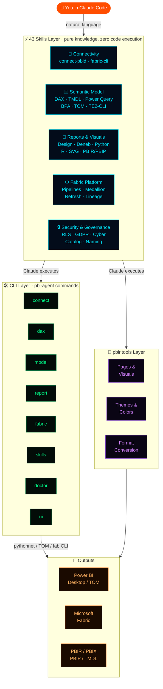
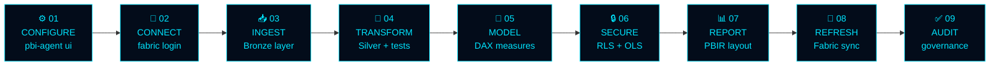
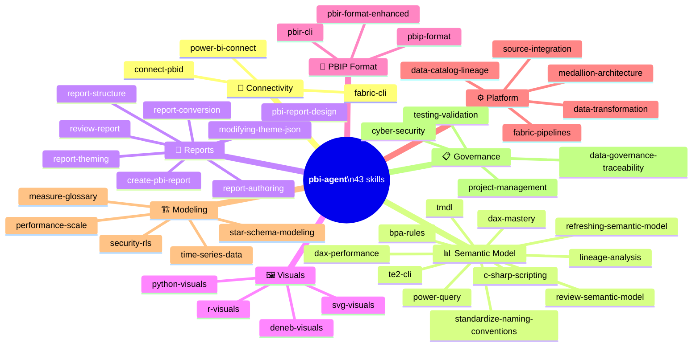

<div align="center">


<br/>

[](https://pypi.org/project/powerbi-agent/)
[](https://pypi.org/project/powerbi-agent/)
[](LICENSE)
[](https://github.com/santoshkanthety/powerbi-agent/stargazers)
[](https://github.com/santoshkanthety/powerbi-agent/actions)
[](https://www.linkedin.com/in/santoshkanthety/)

</div>

---

```
╔══════════════════════════════════════════════════════════════════╗
║  MISSION BRIEFING                                                ║
║                                                                  ║
║  You have data in the wild. Databases, APIs, CSV drops,          ║
║  web feeds. It needs to become board-ready Power BI analytics.   ║
║                                                                  ║
║  Between you and that goal:  medallion architecture decisions,   ║
║  Delta table optimization, Kimball star schemas, 400 lines of    ║
║  DAX, RLS for 5,000 users, PBIR report layouts, Fabric pipelines ║
║  TMDL authoring, BPA audits, Deneb visuals, TOM scripting        ║
║                                                                  ║
║  You know all of this.  It takes time.                           ║
║  POWERBI·AGENT gives that time back.                             ║
╚══════════════════════════════════════════════════════════════════╝
```

---

## `> SYSTEM_OVERVIEW`




---

## `> PREREQUISITES`

Before installing, ensure the following are in place:

| Requirement | Version | Notes |
|---|---|---|
| **Python** | 3.10 – 3.13 | `python --version` (3.14+ works for Fabric/UI; Desktop requires ≤3.13) |
| **pip** | Latest | `python -m pip install --upgrade pip` |
| **Claude Code** | Latest | [Install guide](https://claude.ai/code) — required for skills |
| **Power BI Desktop** | Latest | Windows only · Required for `pbi-agent connect`, DAX, TOM/ADOMD commands |
| **Windows OS** | 10 / 11 | Desktop integration uses .NET/pythonnet — Linux/macOS for Fabric-only workflows |
| **Microsoft Fabric / Power BI Service** | — | Required for `pbi-agent fabric` commands — Azure subscription needed |
| **fab CLI** | Latest | `pip install ms-fabric-cli` — required for `fabric-cli` skill |
| **pbir.tools** | 0.9.4+ | `uv tool install pbir-cli` — required for `report-structure`, `report-theming`, `report-conversion` skills |
| **Azure AD / Entra ID account** | — | Required for Fabric authentication (`pbi-agent fabric login`) |

> **Minimal setup** (Fabric + Claude Code only, no Desktop, any OS): `pip install "powerbi-agent[fabric,ui]"`
> **Full setup** (Desktop + Fabric + UI, Windows + Python ≤3.13): `pip install "powerbi-agent[desktop,fabric,ui]"`

---

## `> INITIALIZE_SEQUENCE`

**Four commands. Full stack online.**

> **Not on PyPI yet?** Install directly from GitHub until the first PyPI release:
> ```powershell
> pip install "powerbi-agent[desktop,fabric,ui] @ git+https://github.com/santoshkanthety/powerbi-agent.git"
> ```

```powershell
# STEP 1 ── Install (Windows PowerShell)
pip install "powerbi-agent[desktop,fabric,ui]"
```

```powershell
# STEP 2 ── Add pip Scripts to PATH (run once — restart terminal after)
$scripts = python -c "import sysconfig; print(sysconfig.get_path('scripts'))"
[Environment]::SetEnvironmentVariable("PATH", $env:PATH + ";$scripts", "User")
# Then restart PowerShell / Command Prompt
```

```powershell
# STEP 3 ── Register 43 skills with Claude Code (one-time)
pbi-agent skills install

# STEP 4 ── Connect to Power BI Desktop
pbi-agent connect
```

> **Verify everything is working:**
> ```powershell
> pbi-agent doctor
> ```

<details>
<summary><code>► What pbi-agent doctor checks</code></summary>

```
Check                                   Status  Detail
─────────────────────────────────────── ─────── ──────────────────────────────
Python version (>=3.10)                 OK      Python 3.12.x
Operating System (Windows)              OK      Windows-11-...
Scripts directory on PATH               OK      pbi-agent found at C:\...\pbi-agent.exe
Power BI Desktop installed              OK      C:\Program Files\...\PBIDesktop.exe
pythonnet (for Desktop integration)     OK      pythonnet 3.0.x
azure-identity (for Fabric integration) --      Not installed (optional)
Connection config                       --      Not connected — run: pbi-agent connect
Claude Code skills installed            OK      43/43 skill(s) installed

All checks passed! You're good to go.
```

> **If "Scripts directory on PATH" shows FAIL**, run the PowerShell command in STEP 2 above and restart your terminal.
</details>

<details>
<summary><code>► Windows troubleshooting guide</code></summary>

**`pbi-agent` not found after install**
```powershell
# Find where pip installed the scripts
python -c "import sysconfig; print(sysconfig.get_path('scripts'))"
# Add to PATH permanently
$scripts = python -c "import sysconfig; print(sysconfig.get_path('scripts'))"
[Environment]::SetEnvironmentVariable("PATH", $env:PATH + ";$scripts", "User")
# Restart PowerShell, then verify:
pbi-agent --version
```

**UnicodeEncodeError / emoji crashes on install**
```powershell
# Force UTF-8 in the current session
$env:PYTHONUTF8 = "1"
pip install "powerbi-agent[desktop,fabric,ui]"
pbi-agent skills install
```

**pythonnet fails on Python 3.14**
```powershell
# pythonnet has no stable release for 3.14 yet — use Python 3.12 or 3.13 for Desktop features
# Fabric and UI extras work on any Python version including 3.14
pip install "powerbi-agent[fabric,ui]"   # no [desktop]
```

**`pbi-agent skills install` reports "Skill file not found"**
```powershell
# If installed from PyPI and skills are missing, force-reinstall to get bundled data
pip install --force-reinstall powerbi-agent
pbi-agent skills install
# Or install from source:
pip install "powerbi-agent[desktop,fabric,ui] @ git+https://github.com/santoshkanthety/powerbi-agent.git"
```

</details>

---

## `> WEB_CONFIG_TOOL`

**Design your entire pipeline visually. No YAML. No JSON editing.**

```bash
pbi-agent ui                          # Opens at http://localhost:8765
pbi-agent ui --project my-platform   # Named project
pbi-agent ui --port 9000 --no-open   # Headless mode
```

```
┌─────────────────────────────────────────────────────────┐
│  ██ POWERBI·AGENT  │ Config Tool          Project: demo │
├────────────┬────────────────────────────────────────────┤
│ Dashboard  │  ┌─────┐  ┌─────┐  ┌─────┐  ┌─────────┐  │
│ ─────────  │  │ 4   │  │ 12  │  │ 8   │  │ Analytics│  │
│ INGEST     │  │Srcs │  │Rules│  │Tbls │  │Workspace │  │
│  Sources   │  └─────┘  └─────┘  └─────┘  └─────────┘  │
│            │                                            │
│ TRANSFORM  │  Sources→Bronze→Silver→Gold→Model→Reports  │
│  Rules     │  ══════════════════════════════════════►   │
│  Model     │                                            │
│            │  [ Add Source ] [ Add Rule ] [ Fabric → ]  │
│ DELIVER    │                                            │
│  Fabric    └────────────────────────────────────────────┘
└────────────┘
```

| Page | What You Configure |
|---|---|
| **Data Sources** | DB connections (SQL Server, PostgreSQL, Oracle, Snowflake), REST APIs (OAuth/Bearer/API Key), CSV uploads, web scrapers — each with load strategy, watermark column, Bronze target |
| **Rule Engine** | Quality checks (not\_null, unique, regex, range), transformations (cast, rename, derive, fill\_null) — each rule has an action: fail\_pipeline / quarantine / drop\_row / flag\_and\_pass |
| **Data Model** | Bronze/Silver/Gold table designer — column definitions, PK/FK relationships, PII flags, SCD type, partition column |
| **Fabric & Power BI** | Workspace, lakehouse, DirectLake toggle, incremental refresh windows, cron schedule — go-live readiness checklist |

---

## `> PIPELINE_SEQUENCE`

**The exact order. Every time.**



```
┌─────────────────────────────────────────────────────────────────────┐
│                                                                     │
│  01. CONFIGURE    pbi-agent ui                                      │
│      ─────────    Add sources · Build rule engine · Design model    │
│                                                                     │
│  02. CONNECT      pbi-agent fabric login                            │
│      ────────     Authenticate with Microsoft Fabric / Azure        │
│                   pbi-agent connect  (Power BI Desktop / TOM)       │
│                                                                     │
│  03. INGEST       Ask Claude:                                       │
│      ───────      "Run the Bronze ingestion for all sources"        │
│                                                                     │
│  04. TRANSFORM    Ask Claude:                                       │
│      ──────────   "Apply Silver transformations and run tests"      │
│                                                                     │
│  05. MODEL        pbi-agent model info                              │
│      ─────        pbi-agent model measures                          │
│                   pbi-agent model add-measure "Total Sales" ...     │
│                   Ask Claude: "Review the semantic model for BPA"   │
│                                                                     │
│  06. SECURE       pbi-agent security roles                          │
│      ──────       pbi-agent security test-rls --user alice@...      │
│                                                                     │
│  07. REPORT       pbi-agent report pages report.pbix                │
│      ──────       pbi-agent report add-page "Executive Summary"     │
│                   Ask Claude: "Review the report design"            │
│                                                                     │
│  08. REFRESH      pbi-agent fabric refresh "Sales Analytics" --wait │
│      ───────                                                        │
│                                                                     │
│  09. AUDIT        pbi-agent model audit --all                       │
│      ─────        Ask Claude: "Run lineage analysis on this model"  │
│                                                                     │
└─────────────────────────────────────────────────────────────────────┘
```

---

## `> COMMAND_REFERENCE`

<details>
<summary><code>► connect — Link to Power BI Desktop</code></summary>

```bash
pbi-agent connect                     # Auto-detect first instance
pbi-agent connect --list              # List all open PBI instances
pbi-agent connect --port 59856        # Specify SSAS port manually
```

Once connected, Claude can use the `connect-pbid` skill to work directly via TOM and ADOMD.NET:
```
"Add a [Total Revenue] measure to the Sales table"
"Run a DAX query showing top 10 customers by lifetime value"
"List all measures with missing descriptions"
```
</details>

<details>
<summary><code>► dax — Query and validate DAX</code></summary>

```bash
# Run a DAX query — results as rich table
pbi-agent dax query "EVALUATE TOPN(10, Products, [Total Sales])"

# Run with output format options
pbi-agent dax query "EVALUATE VALUES(Date[Year])" --format json
pbi-agent dax query "EVALUATE SUMMARIZECOLUMNS(...)" --format csv

# Validate a DAX expression before adding it
pbi-agent dax validate "CALCULATE([Total Sales], SAMEPERIODLASTYEAR(Date[Date]))"
pbi-agent dax validate "SUMX(FILTER(Sales, Sales[Amount] > 1000), Sales[Amount])"
```

**Ask Claude instead (uses `dax-mastery` + `dax-performance` skills):**
```
"Run a DAX query showing top 10 products by sales for 2024"
"Validate this RANKX expression before I add it to the model"
"What's wrong with my time intelligence measure?"
"Optimize this slow measure — server timings show 4.2s FE time"
```
</details>

<details>
<summary><code>► model — Semantic model operations</code></summary>

```bash
# Inspect
pbi-agent model info                          # Model summary
pbi-agent model tables                        # All tables with counts
pbi-agent model measures                      # All measures
pbi-agent model measures --table Sales        # Filtered by table
pbi-agent model relationships                 # All relationships

# Build
pbi-agent model add-measure "Total Sales" \
  "SUM(fact_sales[sales_amount])" \
  --table Sales \
  --format-string "#,0"

pbi-agent model add-measure "Sales YoY%" \
  "DIVIDE([Total Sales] - [Sales PY], [Sales PY])" \
  --table Sales \
  --format-string "0.0%"

# Audit
pbi-agent model audit --check missing-descriptions
pbi-agent model audit --check duplicate-expressions
pbi-agent model audit --all --output audit.html

# Lineage
pbi-agent model lineage --measure "Sales YoY%"
pbi-agent model export-glossary --format markdown --output glossary.md
```

**Ask Claude instead (uses `tmdl`, `review-semantic-model`, `bpa-rules`, `standardize-naming-conventions` skills):**
```
"Review this semantic model against best practices and flag BPA violations"
"Standardize naming conventions — use SQLBI style"
"Edit the TMDL directly to fix the summarizeBy on the ProductKey column"
"Find all measures that reference a deprecated column"
```
</details>

<details>
<summary><code>► report — Report pages and visuals</code></summary>

```bash
# Inspect
pbi-agent report info  report.pbix              # Full structure tree
pbi-agent report pages report.pbix              # List all pages

# Build
pbi-agent report add-page "Executive Summary" report.pbix
pbi-agent report add-page "Operations"        report.pbix
```

**Ask Claude instead (uses `pbi-report-design`, `review-report`, `deneb-visuals`, `modifying-theme-json` skills):**
```
"Review this report against UX and accessibility best practices"
"Create a Deneb bar chart with custom tooltip and IBCS formatting"
"Update the theme JSON to use our brand colors #1a237e and #e53935"
"Add a Python visual showing the sales distribution as a violin plot"
```
</details>

<details>
<summary><code>► fabric — Microsoft Fabric & Power BI Service</code></summary>

```bash
# Auth
pbi-agent fabric login

# Explore
pbi-agent fabric workspaces
pbi-agent fabric datasets --workspace "Analytics Platform"

# Operate
pbi-agent fabric refresh "Sales Analytics" \
  --workspace "Analytics Platform" \
  --wait                                        # Blocks until complete
```

**Ask Claude instead (uses `fabric-cli` skill with fab CLI):**
```
"List all semantic models in the Analytics workspace"
"Trigger a full refresh of the Sales model and wait for completion"
"Query the lakehouse Delta table for freshness — show last 5 rows"
"Deploy the updated model from dev to prod workspace"
"Find all reports connected to the Sales semantic model"
```
</details>

<details>
<summary><code>► skills — Claude Code skill management</code></summary>

```bash
pbi-agent skills install              # Register all 43 skills with Claude Code
pbi-agent skills install --force      # Overwrite existing
pbi-agent skills list                 # Show install status for all skills
pbi-agent skills uninstall            # Remove all skills
```
</details>

<details>
<summary><code>► doctor — Environment diagnostics</code></summary>

```bash
pbi-agent doctor                      # Run all environment checks
```

Checks: Python version, OS, PATH, Power BI Desktop install, pythonnet, azure-identity, connection config, Claude Code skills installed.
</details>

<details>
<summary><code>► ui — Web configuration tool</code></summary>

```bash
pbi-agent ui                          # http://localhost:8765
pbi-agent ui --port 9000              # Custom port
pbi-agent ui --project my-platform   # Named project
pbi-agent ui --no-open                # Don't open browser
```
</details>

---

## `> NATURAL_LANGUAGE_INTERFACE`

**Once skills are installed, Claude Code understands Power BI natively.**

```
╔══════════════════════════ DATA ARCHITECTURE ══════════════════════════╗

  "Design a medallion architecture for a retail company — CRM in
   Salesforce, ERP in SAP, nightly file drops from 3rd-party vendors"

  → Claude designs Bronze/Silver/Gold layer structure,
    recommends partition strategy, SCD types, and DirectLake config

╠══════════════════════════════ DAX ════════════════════════════════════╣

  "Add a rolling 12-month revenue measure with a June fiscal year end"

  pbi-agent model add-measure "Revenue R12M FYTD" \
    "CALCULATE([Total Revenue], DATESINPERIOD(Date[Date],
       LASTDATE(Date[Date]), -12, MONTH))" \
    --table Revenue --format-string "$#,0"

╠══════════════════════════ TMDL AUTHORING ═════════════════════════════╣

  "Fix the summarizeBy on all key columns in the TMDL files"

  → Claude edits definition/tables/*.tmdl directly, applying
    correct indentation, quoting rules, and property ordering.
    Checks for referential integrity before saving.

╠══════════════════════════ LIVE MODEL VIA TOM ═════════════════════════╣

  "Add 15 measures from this spec to the live Power BI Desktop model"

  → Claude uses PowerShell + TOM/ADOMD.NET via connect-pbid skill:
    validates each DAX expression, adds measures atomically,
    calls $model.SaveChanges() — changes appear instantly in PBI Desktop

╠══════════════════════════ PERFORMANCE ════════════════════════════════╣

  "The Executive Dashboard takes 9 seconds to load — fix it"

  → Performance Analyzer run, bottleneck identified (450M row fact table,
    no aggregations, FILTER on fact table in 3 measures)
  pbi-agent fabric optimize-delta --table gold.fact_sales --vorder
  pbi-agent model add-aggregation --table agg_sales_monthly
  → Page load: 9.2s → 0.8s

╠══════════════════════════ DENEB VISUALS ══════════════════════════════╣

  "Create a Deneb bar chart ranked by sales with conditional color
   based on target attainment — IBCS style"

  → Claude generates the full Vega-Lite spec with Power BI field
    bindings, data transforms, and conditional encoding rules.
    Outputs as a PBIR visual.json ready to paste.

╠══════════════════════════ SECURITY ═══════════════════════════════════╣

  "Set up RLS for 300 sales reps — each sees only their territory"

  pbi-agent security add-role "TerritoryFilter" \
    --filter "[Territory] IN CALCULATETABLE(VALUES(UserAccess[territory]),
       UserAccess[email] = USERPRINCIPALNAME())"
  pbi-agent security test-rls --role TerritoryFilter --user rep@co.com
  → RLS applied · 300 users mapped · 5 test profiles passed

╠═══════════════════════════ BPA AUDIT ═════════════════════════════════╣

  "Run Best Practice Analyzer on the model and fix all critical issues"

  → Claude executes Tabular Editor 2 CLI BPA rules, reports violations
    by severity, auto-fixes summarizeBy, formatString, hidden measures,
    and description coverage. Re-runs BPA to confirm zero critical issues.

╠═══════════════════════════ GOVERNANCE ════════════════════════════════╣

  "Generate the full model glossary and find all orphaned measures"

  pbi-agent model export-glossary --format markdown --output glossary.md
  pbi-agent model audit --check unused-measures
  → 47 measures documented · 12 orphans flagged for review

╚═══════════════════════════════════════════════════════════════════════╝
```

---

## `> SKILL_MATRIX`

**43 domain skills loaded into Claude Code by `pbi-agent skills install`:**



```
┌─────────────────────────────────┬──────────────────────────────────────────────────────┐
│ SKILL                           │ TRIGGERS ON                                          │
├─ 🔌 CONNECTIVITY ───────────────┼──────────────────────────────────────────────────────┤
│ connect-pbid                    │ TOM · ADOMD · PowerShell · connect PBI Desktop        │
│ fabric-cli                      │ fab · fab CLI · OneLake · deploy Fabric · lakehouse   │
│ power-bi-connect                │ connect · local instance · no connection              │
├─ 📊 SEMANTIC MODEL ─────────────┼──────────────────────────────────────────────────────┤
│ dax-mastery                     │ DAX · CALCULATE · time intelligence · YTD · YoY       │
│ dax-performance                 │ slow DAX · server timings · FE/SE · anti-patterns     │
│ tmdl                            │ TMDL · .tmdl · edit TMDL · PBIP model files           │
│ power-query                     │ Power Query · M code · M expression · query folding   │
│ review-semantic-model           │ review model · audit model · check model quality      │
│ standardize-naming-conventions  │ naming · rename · SQLBI conventions · clean names     │
│ refreshing-semantic-model       │ refresh · dataset refresh · incremental refresh       │
│ lineage-analysis                │ lineage · downstream reports · impact analysis        │
│ bpa-rules                       │ BPA · best practice · Tabular Editor rules            │
│ c-sharp-scripting               │ C# script · Tabular Editor script · bulk model ops   │
│ te2-cli                         │ Tabular Editor CLI · te2 · BPA CLI · deploy TMDL     │
├─ 🎨 REPORTS ────────────────────┼──────────────────────────────────────────────────────┤
│ pbi-report-design               │ report design · UX · layout · accessibility           │
│ create-pbi-report               │ create report · new report · build report             │
│ review-report                   │ review report · audit report · check report           │
│ report-authoring                │ report · visual · chart · page · bookmark             │
│ report-structure                │ add page · add visual · bind field · pbir.tools       │
│ report-theming                  │ colors · fonts · theme template · conditional format  │
│ report-conversion               │ PBIR/PBIX/PBIP convert · merge · split · rebind      │
│ modifying-theme-json            │ theme JSON · brand colors · custom theme · fonts      │
├─ 🖼️ VISUALS ─────────────────────┼──────────────────────────────────────────────────────┤
│ deneb-visuals                   │ Deneb · Vega · Vega-Lite · custom visual · IBCS       │
│ python-visuals                  │ Python visual · matplotlib · seaborn · plotly         │
│ r-visuals                       │ R visual · ggplot2 · R chart · R script               │
│ svg-visuals                     │ SVG · SVG visual · custom SVG · vector graphic        │
├─ 📁 PBIP / PBIR FORMAT ─────────┼──────────────────────────────────────────────────────┤
│ pbip-format                     │ PBIP · PBIP project · definition.pbir · Git           │
│ pbir-format-enhanced            │ PBIR · visual.json · report.json · PBIR schema        │
│ pbir-cli                        │ PBIR CLI · pbir-cli · export report · import report   │
├─ ⚙️ PLATFORM ───────────────────┼──────────────────────────────────────────────────────┤
│ fabric-pipelines                │ pipeline · ingestion · ETL · watermark · Spark        │
│ medallion-architecture          │ medallion · bronze · silver · gold · lakehouse         │
│ data-transformation             │ union · append · type cast · hash key · schema        │
│ data-catalog-lineage            │ catalog · lineage · Purview · glossary · impact       │
│ source-integration              │ PostgreSQL · JDBC · CSV · REST API · web scrape       │
├─ 🏗️ MODELING & DESIGN ──────────┼──────────────────────────────────────────────────────┤
│ star-schema-modeling            │ star schema · Kimball · SCD · dimension · fact        │
│ measure-glossary                │ measure description · formula · dependency            │
│ performance-scale               │ slow · DirectLake · aggregations · V-Order            │
│ security-rls                    │ RLS · OLS · row-level security · USERPRINCIPALNAME    │
│ time-series-data                │ time series · gaps · binning · intervals · spine      │
├─ 📋 GOVERNANCE ─────────────────┼──────────────────────────────────────────────────────┤
│ data-governance-traceability    │ GDPR · CCPA · lineage · retention · erasure           │
│ testing-validation              │ test · validate · UAT · reconciliation                │
│ project-management              │ delivery · roadmap · sprint · RAID · go-live          │
│ cyber-security                  │ tenant hardening · MFA · embed token · exfiltration   │
└─────────────────────────────────┴──────────────────────────────────────────────────────┘
```

---

## `> PROJECT_STRUCTURE`

```
powerbi-agent/
│
├── src/powerbi_agent/
│   ├── cli.py              ◄── Click CLI · connect · dax · model · report · fabric
│   ├── connect.py          ◄── SSAS auto-detection via workspace port files
│   ├── dax.py              ◄── DAX execution via ADOMD.NET (pythonnet)
│   ├── model.py            ◄── TOM read/write (measures · tables · RLS)
│   ├── report.py           ◄── PBIR JSON manipulation (no Desktop needed)
│   ├── fabric.py           ◄── Power BI REST API · workspace · refresh
│   ├── doctor.py           ◄── Environment health checks (PATH, pythonnet, skills)
│   ├── skills/
│   │   ├── installer.py    ◄── install/uninstall/list 43 skills in ~/.claude/skills/
│   │   └── data/           ◄── Bundled skill .md files (pip install distributes these)
│   └── web/                ◄── FastAPI config tool (pbi-agent ui)
│       ├── app.py
│       ├── models/config.py    ◄── Pydantic models for all config entities
│       ├── routes/             ◄── sources · rules · model · pipeline · api
│       └── templates/          ◄── Tailwind CSS + HTMX pages
│
├── skills/                 ◄── 43 Claude Code skill markdown files
│   │
│   ├── ── CONNECTIVITY ──
│   ├── connect-pbid.md         ◄── TOM/ADOMD.NET via PowerShell (v0.22.4)
│   ├── fabric-cli.md           ◄── fab CLI, DuckDB, OneLake (v0.22.4)
│   ├── power-bi-connect.md
│   │
│   ├── ── SEMANTIC MODEL ──
│   ├── dax-mastery.md
│   ├── dax-performance.md      ◄── Server timings, FE/SE, anti-patterns (v0.22.4)
│   ├── tmdl.md                 ◄── TMDL authoring, indentation, quoting (v0.22.4)
│   ├── power-query.md          ◄── M expressions, query folding (v0.22.4)
│   ├── review-semantic-model.md ◄── Audit, BPA, AI readiness (v0.22.4)
│   ├── standardize-naming-conventions.md ◄── SQLBI style (v0.22.4)
│   ├── refreshing-semantic-model.md (v0.22.4)
│   ├── lineage-analysis.md     ◄── Cross-workspace lineage (v0.22.4)
│   ├── bpa-rules.md            ◄── Tabular Editor BPA (v0.22.4)
│   ├── c-sharp-scripting.md    ◄── TE C# bulk scripting (v0.22.4)
│   ├── te2-cli.md              ◄── Tabular Editor 2 CLI (v0.22.4)
│   │
│   ├── ── REPORTS ──
│   ├── pbi-report-design.md    ◄── Design principles, UX (v0.22.4)
│   ├── create-pbi-report.md    ◄── Step-by-step creation (v0.22.4)
│   ├── review-report.md        ◄── Design audit (v0.22.4)
│   ├── report-authoring.md
│   ├── report-structure.md
│   ├── report-theming.md
│   ├── report-conversion.md
│   ├── modifying-theme-json.md ◄── Custom branding (v0.22.4)
│   │
│   ├── ── VISUALS ──
│   ├── deneb-visuals.md        ◄── Vega/Vega-Lite (v0.22.4)
│   ├── python-visuals.md       ◄── matplotlib, plotly (v0.22.4)
│   ├── r-visuals.md            ◄── ggplot2, plotly (v0.22.4)
│   ├── svg-visuals.md          ◄── SVG custom visuals (v0.22.4)
│   │
│   ├── ── PBIP / PBIR ──
│   ├── pbip-format.md          ◄── PBIP project structure (v0.22.4)
│   ├── pbir-format-enhanced.md ◄── PBIR JSON schemas (v0.22.4)
│   ├── pbir-cli.md             ◄── PBIR CLI operations (v0.22.4)
│   │
│   └── ── PLATFORM / GOVERNANCE ──
│       ├── fabric-pipelines.md
│       ├── medallion-architecture.md
│       ├── [+ 10 more governance, modeling, security skills]
│
├── docs/assets/            ◄── SVG diagrams and visual assets
├── tests/                  ◄── pytest suite · 44 tests · no PBI Desktop required
├── .github/workflows/ci.yml        ◄── Test on Windows + Linux + macOS, Python 3.10–3.13
├── .github/workflows/publish.yml   ◄── Auto-publish to PyPI on git tag (OIDC)
├── pyproject.toml
├── CONTRIBUTING.md
└── ATTRIBUTIONS.md         ◄── License credits (pbi-cli MIT, data-goblin GPL-3.0)
```

---

## `> INSTALL_OPTIONS`

```powershell
# ── From PyPI ───────────────────────────────────────────────────────────────

# Core CLI only (any OS, any Python 3.10+)
pip install powerbi-agent

# + Power BI Desktop integration (Windows, Python ≤3.13 — pythonnet requirement)
pip install "powerbi-agent[desktop]"

# + Microsoft Fabric / Power BI Service (any OS, any Python 3.10+)
pip install "powerbi-agent[fabric]"

# + Web configuration tool (any OS, any Python 3.10+)
pip install "powerbi-agent[ui]"

# Everything (Windows + Python ≤3.13 for full Desktop support)
pip install "powerbi-agent[desktop,fabric,ui]"


# ── From GitHub (latest dev builds) ─────────────────────────────────────────
pip install "powerbi-agent[desktop,fabric,ui] @ git+https://github.com/santoshkanthety/powerbi-agent.git"


# ── Using pipx (auto-manages PATH — recommended for CLI-first users) ─────────
pipx install powerbi-agent
pipx inject powerbi-agent azure-identity fastapi uvicorn
```

> **Python 3.14 users**: The `[desktop]` extra (pythonnet) requires Python ≤3.13. Install without it and use Fabric/UI features: `pip install "powerbi-agent[fabric,ui]"`

---

## `> CONTRIBUTE`

```
The grid is open. All skill levels welcome.

No Python required to contribute:
  · Improve a skill file in skills/  (pure Markdown)
  · Add a real-world DAX pattern or TMDL example
  · Report a bug with reproduction steps
  · Suggest a new CLI command or skill

With Python:
  · Add CLI commands or Fabric API coverage
  · Improve error messages and UX
  · Write tests (pytest, no PBI Desktop required)

SETUP:
  git clone https://github.com/santoshkanthety/powerbi-agent
  cd powerbi-agent
  pip install -e ".[dev]"
  pytest                    # all 44 tests should pass
```

[](https://github.com/santoshkanthety/powerbi-agent/issues)
[](https://github.com/santoshkanthety/powerbi-agent/pulls)

---

## `> ROADMAP`

```
v0.1  ✓ Core CLI (connect · dax · model · report · fabric · doctor · ui)
v0.2  ✓ Windows installation fixes (PATH · UTF-8 · pythonnet · bundled skills)
v0.3  ✓ 43-skill library (TMDL · BPA · Deneb · Python/R visuals · fab CLI ·
         TOM/ADOMD · PBIR/PBIP · Power Query · Naming Conventions · Lineage)
v0.4  ── fab CLI deep integration (DuckDB querying · OneLake · notebook mgmt)
v0.5  ── Tabular Editor 3 CLI integration (full TE3 support + BPA automation)
v0.6  ── Multi-agent workflows (model-auditor · pbip-validator · deneb-reviewer)
v1.0  ── Full agentic pipeline:
          ingest → transform → model → BPA → test → refresh → validate → deploy
```

---

## `> ATTRIBUTIONS`

Inspired by and building on:
- **[pbi-cli](https://github.com/MinaSaad1/pbi-cli)** (Mina Saad) — MIT · direct .NET TOM/ADOMD interop pattern
- **[power-bi-agentic-development](https://github.com/data-goblin/power-bi-agentic-development)** (Kurt Buhler) — GPL-3.0 · 23 production-grade skills ported (v0.22.4)

No code was copied from either project. Skill content adapted under GPL-3.0. See [ATTRIBUTIONS.md](ATTRIBUTIONS.md) for full license details.

*Not affiliated with or endorsed by Microsoft Corporation.*

---

<div align="center">

```
╔═══════════════════════════════════════════════════════════════╗
║                                                               ║
║   ⚡  POWERBI · AGENT  //  TRON ARES  //  v0.3.0             ║
║                                                               ║
║   Built by  SANTOSH KANTHETY                                  ║
║   20+ years of Technology & Data transformation               ║
║   delivery and strategy                                       ║
║                                                               ║
║   43 skills  ·  8 CLI commands  ·  44 tests                   ║
║                                                               ║
║   github.com/santoshkanthety/powerbi-agent                    ║
║   linkedin.com/in/santoshkanthety                             ║
║                                                               ║
║   If this saves you time — give it a ★                        ║
║                                                               ║
╚═══════════════════════════════════════════════════════════════╝
```

</div>
